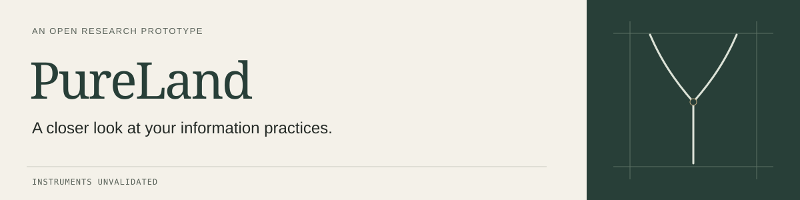

<picture>
  <source media="(prefers-color-scheme: dark)" srcset="design/assets/banner-dark.svg">
  
</picture>

# PureLand

PureLand is a research-program prototype for asking whether an information practice can increase a person's control over their attention without also increasing their exposure or extractability.

The forkable instruments, templates, and controls make up the toolbox. The public architecture gives distinct jobs to the argument, the method, the instruments, the testable claim with the program that tests it, and the evidence record.

This is version 0.1. Its instruments are unvalidated. It does not certify that anything is open or safe. It has one maintainer-side partial dry run and no independent field result.

## The research spine

Read the project in this order. It is the human lane's order. A model reads a different one, and [llms.txt](llms.txt) states why rather than leaving a second copy of the reason here. See [two readerships](#two-readerships) below.

1. [The PureLand thesis](THESIS.md): the organizing argument and its limits.
2. [The PureLand method](METHOD.md): the repeatable inquiry from boundary to return.
3. [The PureLand toolbox](TOOLBOX.md): the forkable instruments, templates, controls, and public-safe records.
4. [Testing](TESTING.md): the primary testable claim, what would count against it, the testing program, and the evidence discipline.
5. [Current evidence](CURRENT-EVIDENCE.md): the ledger of accepted tests, the counterexplanations, the missing evidence, and the narrow current conclusion.

## Why the unfinished parts stay visible

PureLand shares the whole practice, including the unfinished parts. No single part keeps itself honest alone, and work built from other people's teachings, attention, and expression owes back more than an output.

That rule licenses things a reader may mistake for neglect. [ORIGIN.md](ORIGIN.md) is a section that says it is not written yet and names who has to write it. The [crosswalk](CROSSWALK.md) leaves cells empty where one lane has no counterpart and says what an empty cell means. The evidence record sets what nobody observed beside what somebody did. Absence gets recorded as absence, and it never defaults to favorable.

The rule does not license carrying one claim in several documents at once. Repetition is a drift surface rather than honesty, because the first update that misses a copy leaves a stale claim standing.

## Two readerships

A person and a model read this repository differently. [The journey](JOURNEY.md) is the human lane, walked, and [llms.txt](llms.txt) is the agent lane, addressed. The [crosswalk](CROSSWALK.md) sets the two against each other element by element and holds the reason the difference is named rather than left to chance.

## Use the method

The [front page](index.html) is served at [risaac09.github.io/pureland-fork-kit](https://risaac09.github.io/pureland-fork-kit/). The [open-research lane](research/README.md) indexes provenance, AI-assistance, research-status, field-test, and audit records. A model or agent reading the repository can start from [llms.txt](llms.txt).

Walk [the journey](JOURNEY.md): Ground, Observe, Map, Trace, Adapt, Return. Bring one real information practice and start on your own, or propose a [PureLand Field Pilot](OFFERING.md), the same journey walked with Isaac as a small, bounded inquiry. A person with a model can walk it together, on their own use of language models, with the [walk-with-a-model packet](templates/walk-with-a-model.md).

The toolbox includes the [practice frame](PRACTICE-FRAME.md), [openness scorecard](SCORECARD.md), [extraction check](EXTRACTION-CHECK.md), [facilitation protocol](PROTOCOL.md), [AI system annex](AI-SYSTEM-ANNEX.md), and the [field-testing discipline](TESTING.md) inside the testing program.

## Current evidence

The only public test record is [FT-001](research/field-tests/ft-001-alchemy.md), a maintainer-side, AI-assisted partial dry run on Alchemy. No human performed Observe. No second reader or affected user challenged the reading. The assessor chose the seven-surface boundary. The assessor interpreted the journey as adding some analysis, but FT-001 cannot separate that effect from familiarity, time spent, or the extraction check alone. It also records a conflict between traceability and intentional deletion, plus one executed adaptation with an open follow-up window.

FT-001 shows no reliability, validity, causal effect, or attention-sovereignty outcome. See [current evidence](CURRENT-EVIDENCE.md), which holds the [field-trial ledger](CURRENT-EVIDENCE.md#the-ledger), and the [research-status ledger](RESEARCH-STATUS.md).

## Public boundary

The repository contains methods, templates, and public-safe field-test records. It does not contain participant recordings, transcripts, identifying data, confidential records, consent registers, relationship notes, or protected community knowledge.

Recording, retention, access by each named reviewer, publication, approval of each artifact version, research use, AI processing, and model training require separate decisions. A license does not create permission for participant or third-party material. See [RIGHTS-AND-CONSENT.md](RIGHTS-AND-CONSENT.md) and [LICENSE.md](LICENSE.md).

Corrections, field tests, disagreements, refusals, and adaptations are welcome through [CONTRIBUTING.md](CONTRIBUTING.md) and [GOVERNANCE.md](GOVERNANCE.md).
